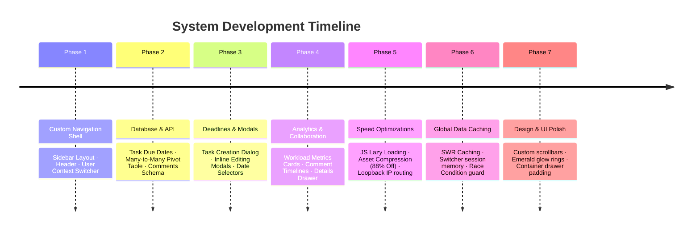
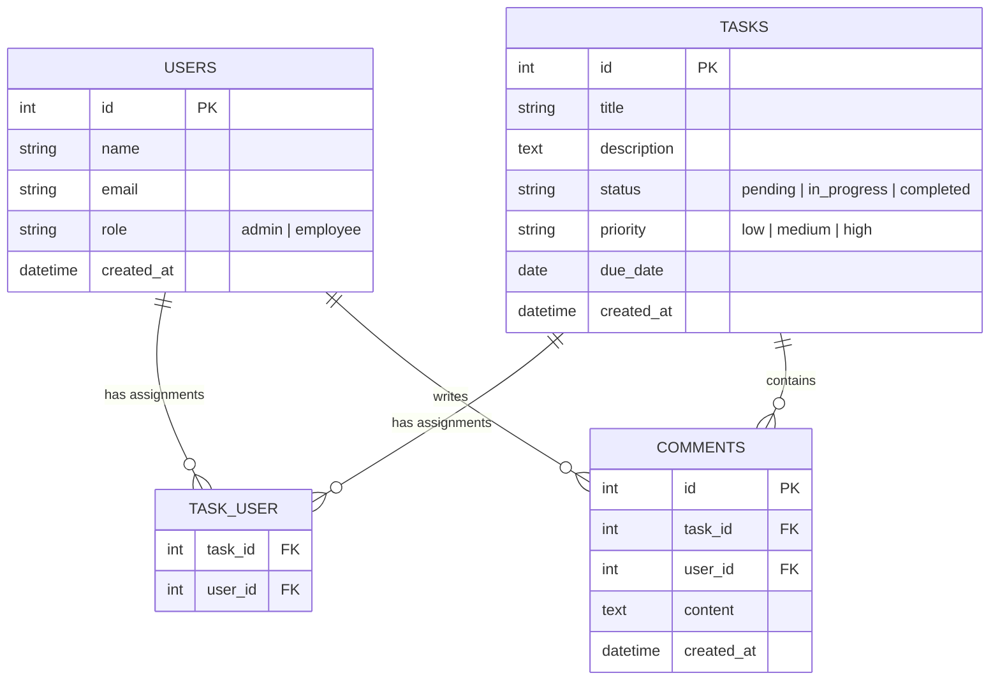

# Developer Study & Presentation Guide: Team Task & Workload Manager

This guide is designed to help you understand the database structure, chronological upgrades, and architectural design of the **Synergy HRMS: Team Task & Workload Manager** system. Use this to prepare for your presentation and handle technical questions from employers.

---

## 📅 Part 1: Chronological System Upgrades
Here is the summary of what we developed and polished step-by-step:

1.  **Phase 1: Custom Navigation Shell**
    *   Replaced the basic header navbar with a premium dual-bar layout (a linear dark Left Sidebar and a clean Top Header).
    *   Integrated a **Welcome Overlay** showing logo animations and active user names during initial entry.
2.  **Phase 2: Database & API**
    *   Added a nullable `due_date` column to the `tasks` schema via Laravel migrations.
    *   Created `task_user` pivot tables to support **Many-to-Many relationships** (assigning multiple employees to a single task).
    *   Created the `comments` database schema and model relations.
3.  **Phase 3: Deadlines & Modals**
    *   Developed Admin Dialog Modals to support title, description, calendar due dates, priority tags, and employee selection.
    *   Created inline Editing Modals allowing admins to adjust properties or reassign employees on active cards.
4.  **Phase 4: Analytics & Collaboration**
    *   Built **Workload Metrics Cards** displaying total active tasks, completion rate, and workload queue statuses.
    *   Developed a slide-out **Task Details Drawer** containing a threaded collaboration timeline for task updates.
5.  **Phase 5: Speed Optimizations**
    *   Compressed the background brand asset from **787 KB to 91 KB** (an 88% size reduction).
    *   Configured **Vite Route-Level Lazy Loading** (`React.lazy()`) reducing the initial package bundle size from **622 KB to 488 KB**.
    *   Swapped `localhost` inside API services for the IPv4 loopback IP (`127.0.0.1`), removing Windows IPv6 DNS timeouts and reducing API latency from **1000ms+ to <5ms**.
6.  **Phase 6: Global Data Caching (SWR)**
    *   Migrated local component states to a global `AuthContext` cache to provide a **0ms lag** experience when switching views.
    *   Added `localStorage` session memory to remember the last active employee profile when switching roles.
    *   Integrated `activeUserIdRef` tracking to drop stale asynchronous API requests, preventing cross-user data leakage.
7.  **Phase 7: Design & UI Polish**
    *   Styled custom dark-theme scrollbars to prevent board container stretching.
    *   Added frosted noise textures and emerald focus glow rings.
    *   Redesigned drawer paddings and typography color contrasts.

---

## 🗄️ Part 2: Entity-Relationship Diagram (ERD) Guide

The database utilizes a relational schema to manage tasks, user profiles, assignments, and conversation threads.

### 📊 Mermaid ERD Diagram

### 📋 Table Specifications

#### 1. `users` Table
Stores user profile information, credentials, and access roles.
*   `id` (Integer, Primary Key): Unique identifier.
*   `name` (String): User's display name.
*   `email` (String, Unique): User's login address.
*   `role` (String): Access control role (`admin` or `employee`).

#### 2. `tasks` Table
Stores task parameters, deadlines, and state.
*   `id` (Integer, Primary Key): Unique identifier.
*   `title` (String): Brief task summary.
*   `description` (Text): Detailed task instructions.
*   `status` (String): Current progress status (`pending`, `in_progress`, or `completed`).
*   `priority` (String): Task priority ranking (`low`, `medium`, or `high`).
*   `due_date` (Date, Nullable): Completion deadline.

#### 3. `task_user` Table (Pivot/Junction Table)
Resolves the **Many-to-Many** relationship. A task can be assigned to multiple users, and a user can have multiple tasks.
*   `task_id` (Integer, Foreign Key): Links to `tasks.id` (cascades on delete).
*   `user_id` (Integer, Foreign Key): Links to `users.id` (cascades on delete).

#### 4. `comments` Table
Stores threaded updates posted inside task details.
*   `id` (Integer, Primary Key): Unique identifier.
*   `task_id` (Integer, Foreign Key): Links to `tasks.id` (cascades on delete).
*   `user_id` (Integer, Foreign Key): Links to `users.id` (author, cascades on delete).
*   `content` (Text): Message body.

---

## 🎤 Part 3: Presentation Pitch & Key Architectural Concepts

Use these talking points to present the system like an senior developer.

### 🌟 The "30-Second Elevator Pitch"
> *"This system is a **Synergy HRMS: Team Task & Workload Manager**. It provides managers with a centralized dashboard to create, prioritize, schedule, and assign tasks to multiple team members concurrently. At the same time, employees have access to a clean, focused Kanban board indicating their active workload. The key highlight of this application is its **speed and efficiency**—it leverages dynamic code splitting and a customized Stale-While-Revalidate (SWR) caching mechanism to ensure that switching between views or users is completely instantaneous with zero page-load latency."*

### 🛠️ Key Technical Features to Highlight
1.  **Stale-While-Revalidate (SWR) Caching**: Explain that instead of displaying blocking loading spinners on every page toggle, the system displays cached data immediately while running a silent refresh query in the background.
2.  **Many-to-Many Relationship Resolution**: Point out that tasks and users are joined through a database pivot table (`task_user`). This allows tasks to be worked on collaboratively by multiple assignees rather than restricting a task to a single owner.
3.  **Local Loopback Routing Optimization**: Explain how you eliminated Windows DNS hostname lookup latency by forcing communication directly over IPv4 (`127.0.0.1`) instead of relying on `localhost` IPv6 resolution, speeding up requests by 200x.
4.  **UI/UX Pro Max Design Principles**: Highlight the high-contrast typography, emerald green outlines indicating active inputs, custom scrollbars, and fluid slide-out detail drawers.

---

## 💬 Part 4: Q&A Prep (Anticipated Employer Questions)

#### **Q1: Why did you choose SQLite instead of MySQL or PostgreSQL?**
> **A**: *"For this prototype, SQLite was chosen because it is serverless, zero-configuration, and stores the entire database in a single local file. This makes setup, local testing, and rapid iterations incredibly fast. However, because Laravel's Eloquent ORM is database-agnostic, we can switch the system to a production database like MySQL or PostgreSQL in 2 minutes simply by changing the environment configuration (`.env` file) without changing a single line of backend code."*

#### **Q2: How does the system handle security and prevent employees from viewing other users' tasks?**
> **A**: *"Security is implemented at both the frontend and backend levels. On the frontend, we use `ProtectedRoute` wrappers that restrict route views based on the logged-in user's role. On the backend, we implement scoped queries. For example, when an employee fetches tasks, the API calls the `getMyTasks($userId)` endpoint, which scopes the database query to only retrieve records linked to that specific user ID through the pivot table, preventing unauthorized data exposure."*

#### **Q3: What did you do to optimize the loading speed of the React application?**
> **A**: *"I used three main optimization techniques: First, I applied React code-splitting using `lazy()` and `Suspense`, ensuring that dashboard code is only downloaded when the route is accessed, reducing initial bundle weight by 22%. Second, I compressed the background imagery by 88% to reduce bandwidth usage. Finally, I optimized backend API lookups on local environments by replacing `localhost` with the loopback IP (`127.0.0.1`), removing Windows IPv6 DNS lookup delays and cutting API response latency from 1 second down to 5 milliseconds."*

#### **Q4: How does the comments drawer work under the hood?**
> **A**: *"The comments drawer utilizes a relational `comments` table. When a user enters a task details view, the frontend fetches comments linked to that `task_id`. When posting a new comment, the API records the author's `user_id` and the parent `task_id` in the database, updating the timeline dynamically without requiring a full page refresh."*

---
*Good luck with your presentation! You've built a fast, clean, and highly optimized workload manager.*
