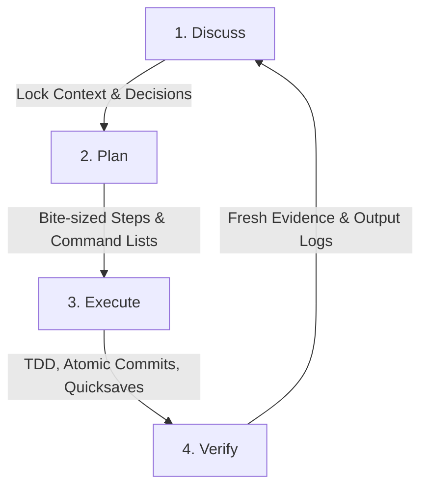

# Lattice Web Development Methodology Report (project-lattice)

Lattice is a structured, unified development methodology designed to enforce engineering discipline, maintain project memory, and prevent architectural drift in full-stack web development. 

This report provides a comprehensive guide to the **project-lattice** domain, detailing its core protocols, cataloging its 19 specialized web development skills, and providing deep dives into its frontend and backend architectural standards.

---

## 1. The Core Architecture of Lattice

Lattice operates on the core principle of **active engineering discipline** rather than passive checklists. It positions the developer (or AI assistant) as a **Collaborative Architect** who reasons before acting, validates decisions with evidence, and acts as the custodian of the project's memory.

### The DPEV Loop
Every web development task or phase follows a strict four-step lifecycle:



1. **Discuss**: Lock down critical requirements, constraints, and design decisions before writing code. Decisions are written to [CONTEXT.md](file:///D:/TeamTask/docs/CONTEXT.md) (or corresponding phase files).
2. **Plan**: Break the implementation into bite-sized tasks with specific file paths, terminal commands, and test suites. Written to [PLAN.md](file:///D:/TeamTask/docs/PLAN.md) and run through a plan-checker.
3. **Execute**: Implement the plan step-by-step using Test-Driven Development (TDD) where applicable, making atomic commits.
4. **Verify**: Provide concrete, runtime evidence (command output, unit test logs) for every single success criterion. Completion is never claimed without fresh, verifiable output. Written to [VERIFICATION.md](file:///D:/TeamTask/docs/VERIFICATION.md).

### The Safety Net: Quicksaves, the 3-Commit Rule, and Tombstones
To prevent wasting time on failing execution paths, Lattice enforces strict git hygiene:
* **Quicksaves**: Before modifying any files in the Execute phase, run the quicksave script (`scripts/quicksave.ps1`) to create a recovery point.
* **The 3-Commit Rule**: If three consecutive commits during execution fail to produce a passing state, the developer must **STOP**, rollback to the quicksave point, log the failed approach in the **Tombstone graveyard** (`TOMBSTONE.md`), and attempt a fundamentally different approach.
* **Tombstone Graveyard (`TOMBSTONE.md`)**: A log in the project root that tracks aborted paths, incompatible libraries, and design dead-ends so the team never repeats historical failures.

### Instructor Mode
Lattice includes an interactive post-session debrief protocol. Initiated by typing `/instructor`, `/teach`, or `/debrief`, it automatically:
* Analyzes the session's git diff and `.lattice-plan.md`.
* Creates **Concept Cards** summarizing key architectural lessons from the actual code written.
* Generates **Socratic questions** to test engineering choices.
* Formulates a **Mini Project** (a scoped building challenge) to reinforce learning.
* Records the interaction in `.lattice-instructor-log.md`.

---

## 2. The 19 Webdev Domain Skills Catalog

Project Lattice organizes specialized web development concerns into **19 Domain Skills** located under `domains/webdev/`. Every skill contains **Iron Laws**, **decision tables**, **failure modes**, **review checklists**, and **integration cross-references**.

| Core Concern | Skill File | Primary Scope |
| :--- | :--- | :--- |
| **Frontend Frameworks** | `skill-frontend.md` | Component hierarchy, client/server rendering, state, routing. |
| **Backend Architecture** | `skill-backend.md` | Request lifecycle, layers (Controller/Service/Repo), queues, side-effects. |
| **REST APIs** | `skill-api-rest.md` | Endpoint design, HTTP status codes, pagination, routing schemas. |
| **GraphQL APIs** | `skill-api-graphql.md` | Schema design, resolver structure, preventing N+1 queries, federation. |
| **Realtime Push** | `skill-api-realtime.md` | WebSockets, Server-Sent Events (SSE), connection limits, backpressure. |
| **Authentication** | `skill-auth.md` | Sessions, JWTs, OAuth, MFA, Role-Based Access Control (RBAC). |
| **Database & Schema** | `skill-database.md` | Schema design, transactions, indexing strategies, query optimization. |
| **Error Handling** | `skill-error-handling.md`| Domain error classes, global handlers, error boundaries, fallbacks. |
| **Observability** | `skill-observability.md` | Structured logs, metrics, correlation IDs, tracing, alert boundaries. |
| **Input Validation** | `skill-validation.md` | Zod/Pydantic schemas, shared validation, sanitization. |
| **Accessibility (a11y)** | `skill-a11y.md` | WCAG compliance, ARIA attributes, keyboard navigation, focus trap. |
| **i18n & Localization**| `skill-i18n.md` | Translation key configuration, RTL support, locale negotiation. |
| **Integrations** | `skill-integrations.md` | Webhooks, exponential backoff, retries, circuit breakers. |
| **Performance** | `skill-performance.md` | Core Web Vitals, code-splitting, bundle budgets, HTTP caching. |
| **QA & Testing** | `skill-qa.md` | Unit/Integration/E2E test setup, resolving flaky tests, CI checks. |
| **Deployment** | `skill-deployment.md` | Blue-green deployments, canary releases, automated rollbacks. |
| **DevOps & Infra** | `skill-devops.md` | Docker, Kubernetes config, Infrastructure as Code, secrets management. |
| **Git Worktrees** | `skill-git-worktrees.md` | Isolated branch work, smart workspace selection, cleanup. |
| **Branch Finishing** | `skill-finishing-branch.md`| PR review checklists, merge strategies, branch cleanup. |

---

## 3. Deep Dive: Frontend Architecture (`skill-frontend.md`)

Lattice frontend discipline addresses component architecture, rendering strategies, styling, and state hygiene to avoid the typical spaghetti layouts associated with modern web applications.

### Iron Laws of Frontend
1. **Choose frameworks for workloads, not resumes**: Match static marketing needs with SSG/ISR (Astro, Eleventy) and real-time dashboard needs with SPA (Vite + React/Svelte).
2. **One source of truth per state**: Server data and local UI state are strictly separated. Never duplicate query responses into global client stores.
3. **Single responsibility components**: A component must have only one reason to change. If it fetches data, handles layout, and formats input, it must be split.
4. **Zero hardcoded strings**: Every user-visible string must utilize translation keys via the localization system.

### State Management Separation
A key failure mode in frontend engineering is storing server-provided datasets in local client stores like Redux, Zustand, or Pinia. Lattice enforces a strict boundary:

```
┌────────────────────────────────────────────────────────┐
│                     FRONTEND STATE                     │
├───────────────────────────┬────────────────────────────┤
│   SERVER STATE (Data)     │    CLIENT STATE (UI)       │
├───────────────────────────┼────────────────────────────┤
│ • Lists, detail, profiles │ • Sidebar open/close flags │
│ • API mutation results    │ • Theme toggles            │
│ • Cached DB responses     │ • Form draft state         │
├───────────────────────────┼────────────────────────────┤
│   TanStack Query / SWR    │   Zustand / React Context  │
└───────────────────────────┴────────────────────────────┘
```

### Component Boundaries
Components are categorized into four strict roles:
* **Data**: Owns query hook or API mutation; passes data down.
* **Layout**: Positions children; contains no logic.
* **Presentation**: Purely renders input props; stateless.
* **Interaction**: Manages local UI states (e.g. `isEditing`, `isOpen`) and event handlers.

---

## 4. Deep Dive: Backend Architecture (`skill-backend.md`)

Lattice backend discipline focuses on structural separation of concerns, middleware safety, and deterministic background job execution.

### Iron Laws of Backend
1. **Controllers are thin**: Parse requests, invoke service layer methods, and format HTTP responses. Controllers must contain zero business logic.
2. **Service layer isolation**: Business logic resides solely in services. Service methods must be completely HTTP-unaware (they accept domain arguments and return domain objects).
3. **Documented middleware pipeline**: Strict ordering is enforced: `Correlation ID` → `Rate Limit` → `Auth` → `Validation` → `Routes` → `Error Handler`. Security hazards arise when this order is shifted.
4. **Out-of-band side effects**: Heavy or unpredictable tasks (email dispatch, PDF rendering, third-party API syncs) must be pushed onto background queues.

### The Service-Repository Layer Pattern
To guarantee testability and decoupling, backends follow a strict routing-to-database layering pattern:

```
[ HTTP Request ] ──> [ Routes / Middleware ] ──> [ Thin Controller ]
                                                          │
                                                          ▼
[ Repositories (Database ORM) ] <── [ Service Layer (Business Logic) ]
                                                          │
                                                          ▼
                                            [ Job Queue (Background Work) ]
```

* **Controller**: Receives the request and invokes service logic.
* **Service**: Executes business rules. If a rule fails, it throws a *Domain Error* (e.g., `ORDER_TOO_LARGE`) rather than an HTTP error.
* **Repository**: Accesses the database. Abstracted away from the service layer so that ORM/SQL engines can be swapped without rewriting business rules.
* **Background Queue**: Handles out-of-band execution (e.g. BullMQ, Celery). Handlers are designed to be **idempotent** so that retries do not duplicate side-effects (like charging a credit card twice).

---

## 5. Integration with External Skills

Lattice acts as the central orchestrator, delegating specific execution duties to specialized external skills:

1. **`ui-ux-pro-max`**: Invoked during project initialization to generate custom design systems and tokens saved to `.lattice/design-system/`.
2. **`design-taste-frontend`**: Auto-triggers on UI file writes to prevent generic, low-grade AI design choices (enforces color palettes, layouts, and typography guidelines).
3. **`andrej-karpathy-skills:karpathy-guidelines`**: Governs formatting and design principles during all active code-writing tasks.
4. **`graphify` / `understand-anything`**: Analyzes directories on-demand to create interactive knowledge graphs and map architectural layers.

---

## 6. Lattice Webdev Compliance Audit Checklist

Before declaring a web development task complete, verify it meets the following standards:

### Architecture
- [ ] Business logic is fully separated from controllers/routing.
- [ ] No database operations are performed directly in HTTP route handlers.
- [ ] Environment variables are validated on system bootstrap (e.g., Zod schema validation for `.env`).

### Frontend Craft
- [ ] Server data is cached and managed via query libraries (e.g., TanStack Query), not manual `useEffect` + `useState`.
- [ ] Page components are Server Components (RSC) by default; `'use client'` is reserved for interactive leaf nodes.
- [ ] UI states cleanly handle Loading, Error, Empty, and Success states.
- [ ] All interactive elements include accessibility tags (e.g., `aria-invalid`, `aria-describedby`).

### Robustness & Safety
- [ ] Side-effects (emails, billing transactions) are queued rather than executed in-process.
- [ ] Background job handlers are fully idempotent.
- [ ] Critical errors are handled by domain-specific error classes.
- [ ] A plan-checker has validated the current `PLAN.md` before execution began.
